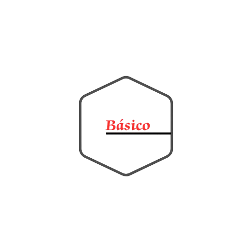

<!-- README.md is generated from README.Rmd. Please edit that file -->

```{r, include = FALSE}
knitr::opts_chunk$set(
  collapse = TRUE,
  comment = "#>",
  fig.path = "man/figures/README-",
  out.width = "100%"
)
```

# basico 

<!-- badges: start -->
[](https://github.com/mkenney/software-guides/blob/master/STABILITY-BADGES.md#work-in-progress)


<!-- badges: end -->

Feature          | Good Practice                                                     | Bad Practice
-----------------|-------------------------------------------------------------------|------------------------------------------------------------------
Words            | Words are spelled out.                                           | Mysterious abbreviations abound, requiring elaborate decoding.
Text Direction   | Words run left to right; minimal vertical text.                  | Words run vertically or in several different directions.
Messages         | Little messages help explain the data.                           | Graphic is cryptic, requiring repeated references to scattered text.
Encoding         | Labels are placed directly on the graphic; no legend is needed.  | Elaborately encoded shadings and obscure codings require back-and-forth references.
Graphic Appeal   | Attracts viewer, provokes curiosity.                              | Graphic is repellent and filled with chartjunk.
Color Usage      | Colors chosen for color-deficient viewers; avoid red/green.      | Red and green used for essential contrasts, limiting accessibility.
Typography       | Clear, precise, modest type; upper-and-lowercase with serifs.    | Clotted, overbearing type; all capitals and sans-serif.
Lettering        | Lettering may be done by hand.                                   | None explicitly specified for bad practices.


## Installation

You can install the development version of basico from [GitHub](https://github.com/) with:

``` r
# install.packages("pak")
pak::pak("jpmonteagudo28/basico")
```

## Example

This is a basic example which shows you how to solve a common problem:

```{r example}
 library(basico)
set_font("Playfair Display")
box_plot(Diet~weight, .data = ChickWeight,
 horizontal = FALSE, median_symbol = "×",
 add_mean = TRUE, n_ticks = 7,
 ylab = "Diet",
 xlab = "Weight(g)")
```

What is special about using `README.Rmd` instead of just `README.md`? You can include R chunks like so:

```{r example2}
x <- mtcars$mpg
set_font("EB Garamond")
histogram(x,breaks = "scott",shape = "segment",show_border = "left",
          label_size = 1.2, main = "Example of a histogram",xlab = "Values",
          ylab = "Frequency")
mtext(paste0("Mean: ", round(mean(x), 2)), side = 3, line = 0.5, cex = 0.8, adj = 1, col = "red4")
```

