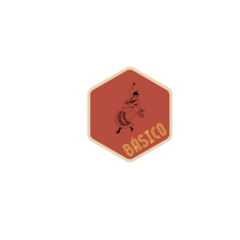

<!-- README.md is generated from README.Rmd. Please edit that file -->

# basico 

<!-- badges: start -->

[](https://github.com/mkenney/software-guides/blob/master/STABILITY-BADGES.md#work-in-progress)

<!-- badges: end -->

| Feature        | Good Practice                                                   | Bad Practice                                                                        |
|----------------|-----------------------------------------------------------------|-------------------------------------------------------------------------------------|
| Words          | Words are spelled out.                                          | Mysterious abbreviations abound, requiring elaborate decoding.                      |
| Text Direction | Words run left to right; minimal vertical text.                 | Words run vertically or in several different directions.                            |
| Messages       | Little messages help explain the data.                          | Graphic is cryptic, requiring repeated references to scattered text.                |
| Encoding       | Labels are placed directly on the graphic; no legend is needed. | Elaborately encoded shadings and obscure codings require back-and-forth references. |
| Graphic Appeal | Attracts viewer, provokes curiosity.                            | Graphic is repellent and filled with chartjunk.                                     |
| Color Usage    | Colors chosen for color-deficient viewers; avoid red/green.     | Red and green used for essential contrasts, limiting accessibility.                 |
| Typography     | Clear, precise, modest type; upper-and-lowercase with serifs.   | Clotted, overbearing type; all capitals and sans-serif.                             |
| Lettering      | Lettering may be done by hand.                                  | None explicitly specified for bad practices.                                        |

## Installation

You can install the development version of basico from
[GitHub](https://github.com/) with:

``` r
# install.packages("pak")
pak::pak("jpmonteagudo28/basico")
```

## Example

This is a basic example which shows you how to solve a common problem:

``` r
# library(basico)
## basic example code
```

What is special about using `README.Rmd` instead of just `README.md`?
You can include R chunks like so:

``` r
summary(cars)
#>      speed           dist       
#>  Min.   : 4.0   Min.   :  2.00  
#>  1st Qu.:12.0   1st Qu.: 26.00  
#>  Median :15.0   Median : 36.00  
#>  Mean   :15.4   Mean   : 42.98  
#>  3rd Qu.:19.0   3rd Qu.: 56.00  
#>  Max.   :25.0   Max.   :120.00
```

You’ll still need to render `README.Rmd` regularly, to keep `README.md`
up-to-date. `devtools::build_readme()` is handy for this.

In that case, don’t forget to commit and push the resulting figure
files, so they display on GitHub and CRAN.
